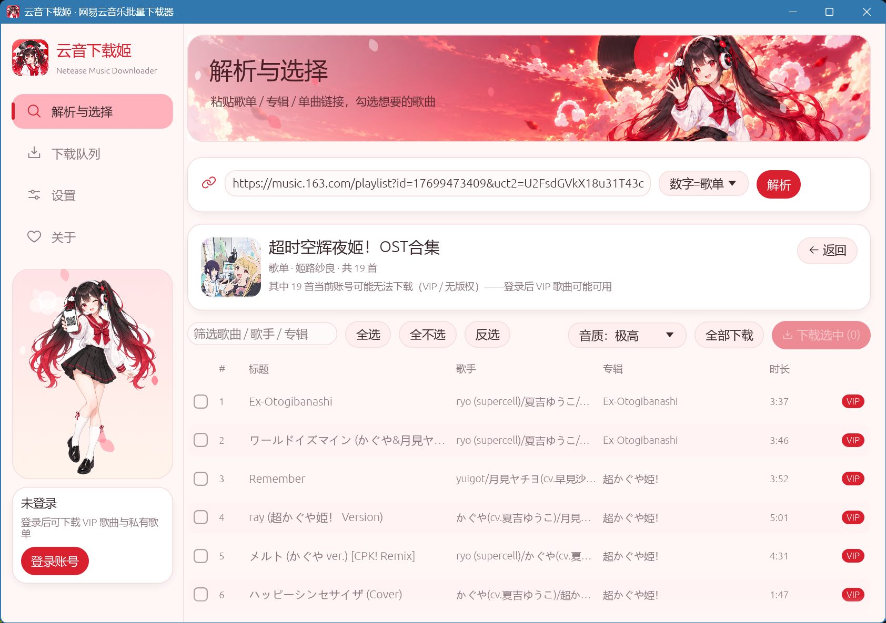
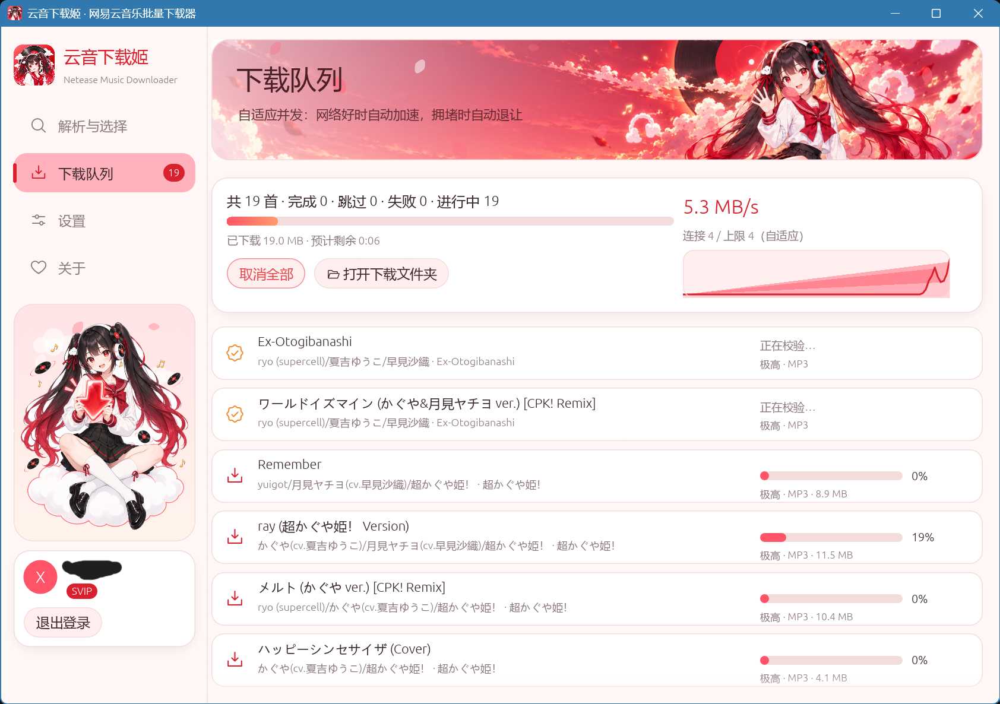
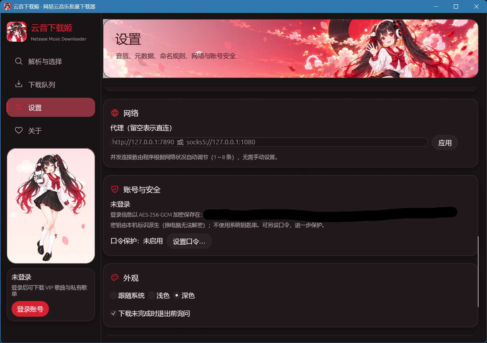

<p align="center">
  
</p>

<h1 align="center">云音下载姬 · Netease Music Downloader</h1>

<p align="center">
  跨平台的网易云音乐批量下载器 —— 歌单 / 专辑 / 单曲，自选音质，自动写入封面与歌词，按网络状况自适应并发。
</p>

<p align="center">
  <a href="https://github.com/XDflight/NeteaseMusicDownloader/actions/workflows/ci.yml"></a>
  <a href="https://github.com/XDflight/NeteaseMusicDownloader/releases/latest"></a>
  
  
</p>

---

## 特性

- **公开与私有歌单、专辑、单曲**：粘贴链接（桌面端 / 手机端 / `163cn.tv` 短链 / App 分享文字）或 ID 即可；登录后还能直接选取「我的歌单」，包括私有歌单。
- **自选音质**：标准 128k → 极高 320k → 无损 → Hi-Res → 环绕声 → 超清母带。所选音质不可用时可自动降级，或按歌曲报错。
- **元数据全套**：标题 / 歌手 / 专辑 / 音轨 / 年份标签，封面（可选 500 / 800 / 1400 px / 原图），歌词。
  - 歌词带时间轴时，**内嵌 LRC 并同时保存 `.lrc` 外挂文件**；外挂文件可改存为 `.txt` 纯文本，或仅在没有时间轴时才改存 `.txt`；可附加翻译或罗马音；支持改为内嵌纯文本。
  - 封面可内嵌，并另存为 `歌名.jpg` 或文件夹封面。
- **自适应并发**：512 KiB 分块 Range 请求，连接数在 1～8 之间根据吞吐量自动增减，拥堵或报错时快速退让，详见 [设计说明](docs/DESIGN.md)。下载后用服务器给出的 MD5 与大小校验。
- **登录与鉴权**：与官方桌面客户端相同的 `eapi` 协议（[协议说明](docs/PROTOCOL.md)）。支持扫码（推荐）、手机号、粘贴 Cookie；登录信息以 **AES-256** 加密保存在本机，不使用系统钥匙串，可另设口令。
- **安装与升级**：Windows 安装程序（简体中文 / English）、便携版、macOS `.dmg`、Linux AppImage / `.deb` / tar.gz；程序内**自动检查 GitHub Releases 并一键升级**（校验 SHA-256）。

## 截图

| 解析与选择（浅色） | 下载中（浅色） |
| --- | --- |
|  |  |

设置（暗色）：



## 下载与安装

到 [Releases](https://github.com/XDflight/NeteaseMusicDownloader/releases/latest) 下载对应平台的文件：

| 平台 | 文件 | 说明 |
| --- | --- | --- |
| Windows x64 | `…-windows-x86_64-setup.exe` | 安装到当前用户目录，无需管理员权限；重复运行即为升级 |
| | `…-windows-x86_64-portable.zip` | 解压即用；数据保存在程序旁的 `data` 文件夹 |
| macOS（Apple 芯片 / Intel） | `…-macos-universal.dmg` | 拖入「应用程序」 |
| Linux x86_64 / aarch64 | `…-linux-<arch>.AppImage` | `chmod +x` 后运行 |
| | `…-linux-<arch>.deb` / `.tar.gz` | Debian 系 / 通用 |

每个版本都附有 `SHA256SUMS.txt`。安装包**没有代码签名**：

- **Windows**：SmartScreen 提示「已保护你的电脑」时，点「更多信息 → 仍要运行」。
- **macOS**：首次打开请右键 → 打开；或执行 `xattr -dr com.apple.quarantine /Applications/NeteaseMusicDownloader.app`。
- **Linux**：中文显示需要 CJK 字体（如 `fonts-noto-cjk`）。

## 使用

1. （可选）点左下角「登录账号」，用网易云音乐手机 App 扫码。登录后可下载会员歌曲，并看到私有歌单。
2. 在「解析与选择」粘贴链接后回车，勾选歌曲，选好音质，点「下载选中」。
3. 在「下载队列」查看进度；完成的歌曲点击即可在文件夹中定位。
4. 命名规则、目录结构、封面与歌词选项都在「设置」里。

> 会员歌曲需要**你自己的**会员账号；本工具不会绕过付费或版权限制。未登录时会员歌曲会提示「需要登录（VIP 歌曲）」。

## 数据与安全

| 内容 | 位置（Windows） |
| --- | --- |
| 设置 | `%APPDATA%\XDflight\NeteaseMusicDownloader\config\settings.json` |
| 登录信息（加密） | `%LOCALAPPDATA%\XDflight\NeteaseMusicDownloader\data\credentials.bin` |
| 日志 | `%LOCALAPPDATA%\XDflight\NeteaseMusicDownloader\data\logs\app.log` |

`credentials.bin` 使用 AES-256-GCM（带认证的加密，篡改会被发现）加密，密钥由 Argon2id 从「本机标识 + 可选口令」派生；文件复制到别的电脑无法解密。它能防止文件被拷走或被随手查看，**不能**防御以同一用户身份运行的恶意程序。细节见 [DESIGN.md](docs/DESIGN.md#credentials)。

## 从源码构建

需要 Rust 1.92 或更新版本（`edition = "2024"`）。Linux 需要 `libx11-dev libxkbcommon-dev libwayland-dev libgl1-mesa-dev`。

```bash
cargo run -p netease-music-downloader            # 调试运行
cargo build --release -p netease-music-downloader  # 发行构建
cargo test --workspace                           # 单元测试（不联网）
```

对真实服务的手动检查（匿名，请求很少）：

```bash
cargo run -p ncm-api  --example probe          # 协议：歌单 / 歌曲 / 地址 / 歌词 / 扫码
cargo run -p ncm-core --example fetch_live     # 分块下载 + MD5 校验 + 自适应并发
cargo run -p ncm-core --example engine_live    # 完整流水线，写入标签并读回
```

重新生成美术资源（精灵图、图标、安装器图片）：

```bash
cargo run -p asset-tool -- all
```

## 发布（维护者）

1. 修改 `Cargo.toml` 中 `[workspace.package]` 的 `version`，提交。
2. 打标签并推送：`git tag -s v0.2.0 && git push origin v0.2.0`。标签必须与 Cargo 版本一致，否则工作流会失败。
3. `Release` 工作流会构建 Windows / macOS / Linux 的全部安装包，生成 `SHA256SUMS.txt` 并创建 GitHub Release。带 `-` 的版本（如 `0.2.0-beta.1`）会标为预发布。
4. 已安装的用户会在下次启动时收到升级提示（设置里可关闭自动检查，或选择包含预发布版本）。

在 Actions 页面手动运行 `Release` 只会构建并上传产物，不会发布。

## 项目结构

```
crates/
  ncm-api/      eapi 加密、HTTP 客户端、登录、歌单/歌曲/歌词/地址接口
  ncm-core/     下载引擎（自适应并发、分块下载、流水线）、标签、歌词、命名、凭据加密、设置
  ncm-update/   GitHub Releases 检查、校验下载、分平台安装
  app/          egui 图形界面
tools/asset-tool/   把原始美术处理成精灵图、图标、安装器图片
packaging/          NSIS 安装脚本、macOS 打包脚本、Linux 桌面文件与打包脚本、图标
assets/source/      原始美术（AI 生成，见其中的 README）
docs/               协议说明、设计说明
```

## 常见问题

**提示「需要登录（VIP 歌曲）」** —— 该歌曲需要会员。用有会员的账号登录后重试（重试失败项即可）。

**手机号登录失败** —— 网易云对手机号登录有风控，可能要求图形验证。请改用扫码登录。

**会不会被封号 / 风控？** —— 这是非官方客户端，无法保证。程序尽量表现得像一个正常的桌面客户端：与官方 3.1.23 一致的请求头和 User-Agent，先领取访客令牌，设备标识稳定不变，请求带抖动地放慢，遇到限流会退避；但**不会**伪造风控令牌、破解验证码或轮换设备 ID（详见 [协议说明](docs/PROTOCOL.md#client-identity-and-behaviour)）。建议用扫码登录、一个账号只在一处使用、不要反复批量解析成千上万首歌。

**下载很慢** —— 并发数由程序自动调节（1～8 条）。可在「设置 → 网络」配置代理；「下载队列」右上角能看到当前连接数与吞吐曲线。

**中文显示为方块（Linux）** —— 安装 CJK 字体，例如 `sudo apt install fonts-noto-cjk`。

## 免责声明

本工具仅供个人学习，以及备份你本人有权访问的音乐。请遵守网易云音乐的服务条款和所在地的版权法律，不要传播下载内容。本项目与网易公司无任何关联，「网易云音乐」是其商标。

美术资源由图像生成模型创作，为原创角色，不含官方 logo 或任何商标图形，也与网易公司无关联。

## License

[AGPL-3.0](LICENSE)

---

## English summary

A cross-platform batch downloader for NetEase Cloud Music playlists, albums and songs, built in Rust with an egui interface. It speaks the same encrypted `eapi` protocol as the official **desktop** client, supports QR / phone / cookie login (the session is stored on disk encrypted with AES-256, without the OS keychain), lets you choose the audio quality, embeds tags, cover art and time-tagged lyrics (plus `.lrc` and cover sidecar files), and adapts the number of parallel connections (1–8, 512 KiB range chunks) to the network. Installers for Windows (NSIS), macOS (`.dmg`) and Linux (AppImage / `.deb` / tarball) are built by GitHub Actions, and the app updates itself from GitHub Releases with SHA-256 verification.

Build: `cargo build --release -p netease-music-downloader` (Rust ≥ 1.92). See [docs/PROTOCOL.md](docs/PROTOCOL.md) and [docs/DESIGN.md](docs/DESIGN.md) for the protocol and internals. VIP tracks require your own VIP account; the tool does not bypass paywalls or copyright restrictions.
